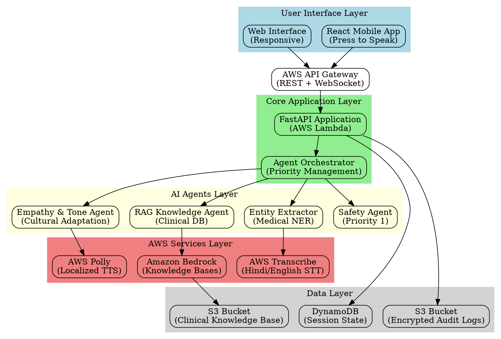
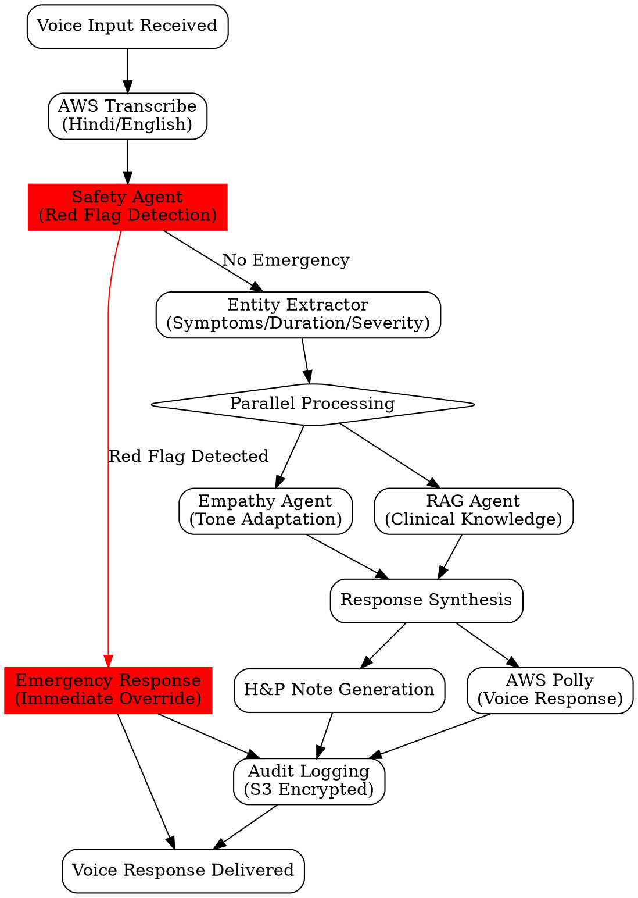

# Design Document

## Overview

Sarthi-AI is a voice-first, multilingual medical triage system built on a serverless AWS architecture with a 4-agent orchestration workflow. The system processes voice input through AWS Transcribe, coordinates multiple AI agents for medical analysis, and delivers culturally appropriate responses via AWS Polly. The architecture prioritizes emergency detection, maintains sub-2-second response times, and generates physician-ready documentation for rural healthcare workers.

## Architecture

### High-Level Architecture



### Agent Orchestration Flow



## Components and Interfaces

### 1. Agent Orchestrator

**Purpose**: Coordinates the 4-agent workflow with priority management and parallel processing.

**Key Interfaces**:
```python
class AgentOrchestrator:
    def process_voice_input(self, audio_stream: AudioStream, session_id: str) -> VoiceResponse
    def handle_emergency_override(self, red_flags: List[str]) -> EmergencyResponse
    def coordinate_parallel_agents(self, entities: MedicalEntities) -> TriageResponse
```

**Responsibilities**:
- Manage agent execution priority (Safety Agent always first)
- Coordinate parallel processing of RAG and Empathy agents
- Handle emergency overrides and workflow termination
- Maintain session state and context

### 2. Safety Agent

**Purpose**: Real-time detection of emergency keywords with absolute priority override.

**Key Interfaces**:
```python
class SafetyAgent:
    def scan_for_red_flags(self, transcribed_text: str, language: str) -> RedFlagResult
    def generate_emergency_response(self, red_flags: List[str], location: Location) -> EmergencyResponse
    def update_red_flag_database(self, new_keywords: List[str]) -> bool
```

**Red Flag Categories**:
- Cardiac: chest pain, heart attack, cardiac arrest
- Respiratory: difficulty breathing, choking, severe asthma
- Neurological: stroke symptoms, seizures, loss of consciousness
- Trauma: severe bleeding, fractures, head injuries
- Obstetric: pregnancy complications, severe bleeding

### 3. Entity Extractor

**Purpose**: Medical Named Entity Recognition from transcribed voice input.

**Key Interfaces**:
```python
class EntityExtractor:
    def extract_medical_entities(self, transcribed_text: str) -> MedicalEntities
    def assess_symptom_severity(self, symptoms: List[Symptom]) -> SeverityLevel
    def extract_temporal_information(self, text: str) -> Duration
```

**Entity Types**:
- Symptoms: pain, fever, nausea, dizziness
- Body parts: chest, head, stomach, leg
- Duration: acute, chronic, hours, days, weeks
- Severity: mild, moderate, severe, unbearable
- Associated factors: triggers, relieving factors

### 4. RAG Knowledge Agent

**Purpose**: Query verified clinical databases for evidence-based medical guidance.

**Key Interfaces**:
```python
class RAGAgent:
    def query_clinical_knowledge(self, entities: MedicalEntities) -> ClinicalGuidance
    def assess_triage_priority(self, symptoms: List[Symptom]) -> TriagePriority
    def generate_care_recommendations(self, clinical_data: ClinicalData) -> CareRecommendations
```

**Knowledge Sources**:
- WHO clinical guidelines
- Indian medical protocols
- Rural health best practices
- Common conditions database
- Drug interaction databases

### 5. Empathy & Tone Agent

**Purpose**: Ensure culturally sensitive, calm, and appropriate communication.

**Key Interfaces**:
```python
class EmpathyAgent:
    def adapt_cultural_tone(self, response: str, user_profile: UserProfile) -> str
    def apply_empathy_filters(self, medical_advice: str) -> str
    def localize_communication(self, text: str, language: str, region: str) -> str
```

**Cultural Adaptations**:
- Respectful address forms (ji, sahib)
- Family-centered communication
- Religious sensitivity
- Gender-appropriate language
- Regional dialect considerations

## Data Models

### Core Data Structures

```python
@dataclass
class VoiceSession:
    session_id: str
    user_id: Optional[str]
    timestamp: datetime
    language: str
    location: Optional[Location]
    audio_data: bytes
    transcription: str
    entities: MedicalEntities
    triage_result: TriageResult
    response_audio: bytes
    physician_note: PhysicianDeliverable

@dataclass
class MedicalEntities:
    symptoms: List[Symptom]
    body_parts: List[str]
    duration: Duration
    severity: SeverityLevel
    associated_factors: List[str]
    temporal_pattern: str

@dataclass
class Symptom:
    name: str
    severity: SeverityLevel
    duration: Duration
    location: str
    quality: str  # sharp, dull, burning, etc.
    associated_symptoms: List[str]

@dataclass
class TriageResult:
    priority: TriagePriority  # EMERGENCY, URGENT, ROUTINE
    recommendations: List[str]
    red_flags: List[str]
    follow_up_needed: bool
    referral_required: bool

@dataclass
class PhysicianDeliverable:
    patient_id: str
    chief_complaint: str
    history_present_illness: str
    review_of_systems: str
    assessment: str
    plan: str
    triage_priority: TriagePriority
    generated_timestamp: datetime
```

### Database Schema

**DynamoDB Tables**:

1. **VoiceSessions**
   - Partition Key: session_id
   - Sort Key: timestamp
   - Attributes: user_id, language, location, entities, triage_result
   - TTL: 30 days for privacy compliance

2. **UserProfiles**
   - Partition Key: user_id
   - Attributes: preferred_language, location, medical_history_summary
   - Privacy: Encrypted at rest

3. **RedFlagKeywords**
   - Partition Key: language
   - Sort Key: category
   - Attributes: keywords, severity_level, last_updated

**S3 Storage Structure**:
```
sarthi-ai-audit-logs/
├── year=2024/
│   ├── month=01/
│   │   ├── day=15/
│   │   │   ├── voice-recordings/
│   │   │   ├── transcriptions/
│   │   │   └── physician-notes/
```

## Correctness Properties

*A property is a characteristic or behavior that should hold true across all valid executions of a system—essentially, a formal statement about what the system should do. Properties serve as the bridge between human-readable specifications and machine-verifiable correctness guarantees.*

Based on the prework analysis, the following properties validate the system's correctness:

**Property 1: Emergency Override Behavior**
*For any* voice input containing red flag keywords, the Safety Agent should immediately override all other processing, provide emergency instructions, and log the interaction with complete audit information.
**Validates: Requirements 1.1, 1.2, 1.3, 1.5**

**Property 2: Transcription Accuracy**
*For any* valid Hindi or English audio input, the Entity Extractor should achieve 95% or higher transcription accuracy and extract medical entities when present.
**Validates: Requirements 2.1, 2.2**

**Property 3: Response Time Performance**
*For any* voice input under normal network conditions, the complete voice-to-voice processing cycle should complete within 2 seconds.
**Validates: Requirements 2.3, 6.2**

**Property 4: Low Confidence Handling**
*For any* transcription with confidence below 80%, the system should request user clarification rather than proceeding with uncertain data.
**Validates: Requirements 2.5**

**Property 5: Clinical Knowledge Integration**
*For any* identified medical symptoms, the RAG Agent should query clinical databases and provide evidence-based recommendations appropriate to symptom severity.
**Validates: Requirements 3.1, 3.2**

**Property 6: Fallback Recommendations**
*For any* query where no relevant clinical information is found, the RAG Agent should recommend consulting a healthcare professional.
**Validates: Requirements 3.4**

**Property 7: Controlled Substance Restrictions**
*For any* query related to Schedule H controlled substances, the system should never provide prescription recommendations.
**Validates: Requirements 3.5**

**Property 8: Language Simplification**
*For any* generated response, the Empathy Agent should avoid medical jargon and use language appropriate for the use

